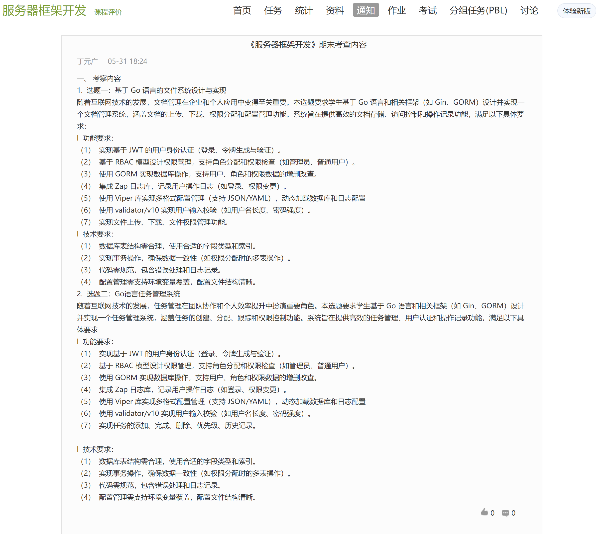

# 《服务器框架开发》期末考查内容

丁元广 05-31 18:24

## 一、考察内容

### 1．选题一：基于 Go 语言的文件系统设计与实现

随着互联网技术的发展，文档管理在企业和个人应用中变得至关重要。本选题要求学生基于 Go语言和相关框架（如Gin、GORM）设计并实现一个文档管理系统，涵盖文档的上传、下载、权限分配和配置管理功能。系统旨在提供高效的文档存储、访问控制和操作记录功能，满足以下具体要求:

#### I 功能要求:

##### （1）实现基于JWT的用户身份认证（登录、令牌生成与验证）。

##### （2）基于 RBAC 模型设计权限管理，支持角色分配和权限检查（如管理员、普通用户）。

##### （3）使用 GORM 实现数据库操作，支持用户、角色和权限数据的增删改查。

##### （4）集成Zap日志库，记录用户操作日志（如登录、权限变更）。

##### （5）使用Viper 库实现多格式配置管理（支持JSON/YAML），动态加载数据库和日志配置

##### （6）使用validator/v10实现用户输入校验（如用户名长度、密码强度）。

##### （7）实现文件上传、下载、文件权限管理功能。

#### II 技术要求：

##### （1）数据库表结构需合理，使用合适的字段类型和索引。

##### （2）实现事务操作，确保数据一致性（如权限分配时的多表操作）。

##### （3）代码需规范，包含错误处理和日志记录。

##### （4）配置管理需支持环境变量覆盖，配置文件结构清晰。

### 2．选题二：Go语言任务管理系统

随着互联网技术的发展，任务管理在团队协作和个人效率提升中扮演重要角色。本选题要求学生基于 Go语言和相关框架（如 Gin、GORM）设计并实现一个任务管理系统，涵盖任务的创建、分配、跟踪和权限控制功能。系统旨在提供高效的任务管理、用户认证和操作记录功能，满足以下具体要求:

#### I 功能要求:

##### （1）实现基于JWT 的用户身份认证（登录、令牌生成与验证）。

##### （2）基于 RBAC 模型设计权限管理，支持角色分配和权限检查（如管理员、普通用户）。

##### （3）使用 GORM 实现数据库操作，支持用户、角色和权限数据的增删改查。

##### （4）集成Zap 日志库，记录用户操作日志（如登录、权限变更）。

##### （5）使用Viper 库实现多格式配置管理（支持JSON/YAML），动态加载数据库和日志配置

##### （6）使用validator/v10 实现用户输入校验（如用户名长度、密码强度）。

##### （7）实现任务的添加、完成、删除、优先级、历史记录。

#### II 技术要求:

##### （1）数据库表结构需合理，使用合适的字段类型和索引引。

##### （2）实现事务操作，确保数据一致性（如权限分配时的多表操作）。

##### （3）代码需规范，包含错误处理和日志记录。

##### （4）配置管理需支持环境变量覆盖，配置文件结构清晰。

##### 原图文：

